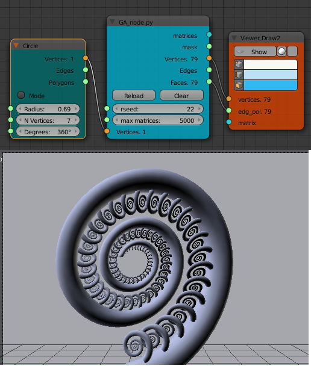

#About

This is an adaption of github/prideout/lsystem code to be used as a [Sverchok](http://nikitron.cc.ua/sverchok_en.html) scripted node within [Blender](http://www.blender.org).

It produces 3D LSystem geometric structures using the xml notation explained on the [Little Grasshopper](http://prideout.net/blog/?p=44) blog.

This xml notation is in turned derived from the eisenscript used in [Structure Synth](http://structuresynth.sourceforge.net/)

##Getting Started

See the [posts](http://elfnor.com/structure-synth-meets-sverchok-generative-art-inside-blender.html) on my blog Look Think Make for more details.

To use the generative art/lsystem node in Blender first install the [Sverchok](http://nikitron.cc.ua/sverchok_en.html) addon. Load the three python files (```LSystem_blender.py, GA_xml.py, GA_node.py```) as separate text blocks into a blend file. Add a "Scripted Node" to a Sverchok node tree. On the node select the ```GA_node.py``` code from the lower drop down. Then click the plugin icon to the right of this field. The node should turn blue with some inputs and outputs. Wire the matrices output to a "Viewer Draw" node and you should see some geometry as below.


The vertices input and output can also be used to "skin" the structure rather than placing separate objects at each location.



This code was developed with Blender v2.73 and Sverchok 0.5.1.0


